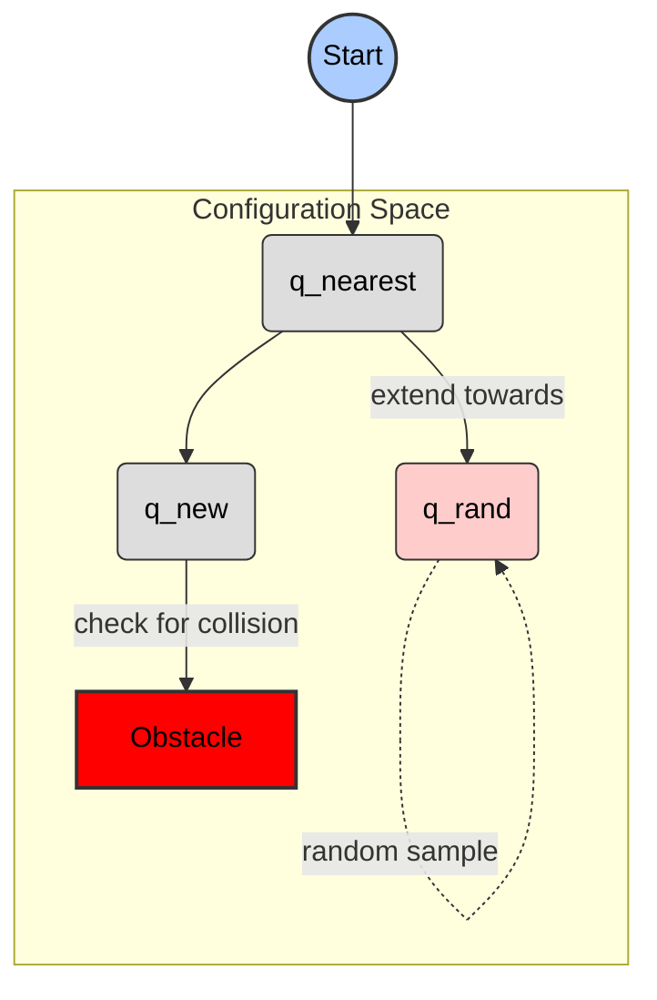

## Introduction

Welcome back! In previous chapters, we delved into how autonomous systems **perceive** their surroundings using techniques like sensor fusion and then make complex **decisions** through AI decision pipelines. But what happens after a robot knows where it is and what it wants to do? How does it actually *move* to achieve its goals without crashing into obstacles or getting lost?

This is where **Motion Planning** comes into play. Motion planning is the algorithmic process of finding a path, trajectory, or sequence of movements for a robot to navigate from a starting point to a target destination while adhering to various constraints—like avoiding obstacles, respecting joint limits, and optimizing for speed or energy. It acts as the vital bridge, translating high-level decisions into concrete, executable actions. This chapter will introduce the fundamental concepts behind motion planning, explore different types of planners, and discuss the challenges of real-world implementation, laying the groundwork for how robots bring their intelligent decisions to life.

## What is Motion Planning?

Motion planning in robotics is like finding a route on a map, but for a robot. It's the process of figuring out how a robot can move from a starting point to a destination without hitting anything or getting stuck.

### Formal Definition

Motion planning is the computational problem of finding a sequence of valid configurations that moves an object (e.g., a robot) from a starting configuration to a target configuration, while avoiding collisions with obstacles in its environment.

### Key Concepts

*   **Configuration Space (C-space):** Imagine all the possible ways a robot can be positioned and oriented. This entire collection of possibilities is called the Configuration Space (C-space). For a simple mobile robot, its configuration might just be its (x, y) coordinates and its orientation (yaw angle). For a robot arm, it would include the angles of all its joints. The C-space allows us to represent the robot's state concisely.
*   **Free Space vs. Obstacle Space:**
    *   **Free Space:** These are all the configurations (positions and orientations) of the robot where it *doesn't* collide with any obstacles in its environment. This is the navigable area for the robot.
    *   **Obstacle Space:** These are all the configurations where the robot *would* collide with an obstacle. This includes places where even a part of the robot (like an arm or a wheel) touches something. The goal of motion planning is to find a path that stays entirely within the Free Space.
*   **Path vs. Trajectory:**
    *   **Path:** This is a purely geometric description of the robot's movement – just a sequence of configurations from a start configuration to a target configuration. It defines *what* positions the robot goes through, without considering time.
    *   **Trajectory:** This adds time to the path. A trajectory specifies not only the sequence of configurations but also *when* the robot should be at each point, including its velocity and acceleration. It describes *how* and *when* the robot moves along a path.

### Challenges in Motion Planning

Motion planning is not always straightforward due to several inherent complexities:

*   **High-dimensional spaces:** The more complex a robot is (e.g., a humanoid robot with many joints), the higher the dimensionality of its C-space becomes. This "curse of dimensionality" makes searching for a valid path exponentially harder.
*   **Dynamic environments:** In many real-world scenarios, the environment is not static. Obstacles (like people or other robots) can move, requiring the robot to constantly perceive its surroundings and replan its movements in real-time.
*   **Computational complexity:** Finding the optimal (e.g., shortest, fastest, safest) path in a complex, high-dimensional, and dynamic C-space can require a huge amount of computing power and time. Researchers are continuously developing more efficient algorithms to tackle these computational challenges.


## Common Planning Algorithms (Conceptual)

Motion planning is a fundamental problem in robotics, where the goal is to find a sequence of valid configurations (a path) for a robot to move from a start state to a goal state while avoiding obstacles. Two common and powerful algorithms used for this are A* and Rapidly-exploring Random Trees (RRT/RRT*).

### Context: Other Search Algorithms

Before diving into A* and RRT, it's helpful to understand their simpler cousins:

*   **Breadth-First Search (BFS):** Explores all neighbor nodes at the current depth level before moving on to nodes at the next depth level. It guarantees finding the shortest path in terms of the number of steps in an unweighted graph.
*   **Dijkstra's Algorithm:** A generalization of BFS for graphs where edges have different "costs" or "weights." It finds the shortest path from a single source node to all other nodes in a graph with non-negative edge weights.

While effective, BFS and Dijkstra's can be slow for large search spaces because they explore many unpromising paths. This is where A* comes in.

---

### A* (A-star) Algorithm

A* is a widely used pathfinding algorithm, particularly effective in environments that can be represented as a graph or a grid (like a map). It's an extension of Dijkstra's algorithm that uses a "heuristic" function to guide its search, making it much more efficient.

**Concept:**
Imagine you're trying to find the quickest route on a map. Dijkstra's would explore every road, even those leading away from your destination, to find the absolute shortest path. A* is smarter: it uses an estimated "time to arrival" (the heuristic) to prioritize exploring roads that seem to head in the right direction.

A* evaluates each potential step (node) using a cost function `f(n) = g(n) + h(n)`:

*   `g(n)`: The actual cost (e.g., distance, time) from the starting point to the current node `n`.
*   `h(n)`: The estimated cost (heuristic) from the current node `n` to the goal. This estimate must never overestimate the actual cost (it must be "admissible") to guarantee finding the optimal path.

By combining the known cost (`g`) with an informed estimate (`h`), A* prioritizes nodes that are both cheap to reach and appear to be close to the goal.

**When it's used:**
*   Navigation in static, known environments (e.g., robot moving on a factory floor with a known blueprint).
*   Video game AI for character pathfinding.
*   Shortest path problems on grids.

**Mermaid Diagram (Conceptual A*):**

```mermaid
graph TD
    start[Start] --> A{Node A (g=2, h=8, f=10)}
    start --> B{Node B (g=3, h=3, f=6)}
    B --> C{Node C (g=5, h=2, f=7)}
    B --> D{Node D (g=6, h=1, f=7)}
    C --> goal[Goal (g=7, h=0, f=7)]
    D --> goal
    A --> E{Node E (g=4, h=7, f=11)}

    style start fill:#acf,stroke:#333,stroke-width:2px,color:#000
    style goal fill:#acf,stroke:#333,stroke-width:2px,color:#000
    classDef heuristicFill fill:#f9f,stroke:#333,stroke-width:1px,color:#000
    class A heuristicFill
    class B heuristicFill
    class C heuristicFill
    class D heuristicFill
    class E heuristicFill
```
*In this diagram, Node B and D are explored first because they have lower `f` values (closer to goal estimate).*

---

### Rapidly-exploring Random Trees (RRT/RRT*)

While A* is great for grid-like environments, it struggles in complex, high-dimensional spaces (like controlling a robot arm with many joints) or when the environment is unknown. RRT and RRT* are probabilistic algorithms designed to quickly explore such spaces and find a feasible (though not necessarily optimal) path.

**Concept (RRT):**
Imagine a robot arm trying to reach an object in a cluttered room. Instead of systematically mapping every possible joint configuration, RRT "grows" a tree of possible robot states by randomly sampling points in the space.

The process is generally:
1.  **Start:** Initialize a tree `T` with the robot's starting configuration.
2.  **Sample:** Pick a random point `q_rand` in the configuration space.
3.  **Nearest:** Find the node `q_nearest` in `T` that is closest to `q_rand`.
4.  **Extend:** Try to extend `q_nearest` towards `q_rand` by a small, fixed step size, creating a new node `q_new`.
5.  **Check:** If the path from `q_nearest` to `q_new` is collision-free, add `q_new` to `T` and connect it to `q_nearest`.
6.  **Repeat:** Continue until `q_new` is close enough to the goal configuration.

RRT is "rapidly-exploring" because the random sampling combined with extending towards these samples biases the tree to explore new, unvisited regions of the space quickly.

**RRT\* (RRT-star):**
RRT\* is an extension of RRT that guarantees "asymptotic optimality." This means that if you let RRT\* run for an infinite amount of time, the path it finds will converge to the truly optimal path (shortest, smoothest, etc.).

It achieves this by adding two key steps after `q_new` is added:
1.  **Rewire (Nearest Neighbors):** It looks for other nodes in the tree (`q_neighbors`) near `q_new`. If `q_new` offers a cheaper path to any `q_neighbors` than their current path, it rewires those neighbors to connect through `q_new`.
2.  **Choose Parent:** Before adding `q_new`, it also checks if any `q_neighbors` could offer a cheaper path from the start to `q_new` than `q_nearest` does, and picks the best one as `q_new`'s parent.

**When they are used:**
*   High-dimensional robot arms or humanoid robots.
*   Uncertain or dynamic environments where a complete map isn't available or changes frequently.
*   When a "good enough" path is needed quickly, and optimality can be improved over time (RRT\*).

**Mermaid Diagram (Conceptual RRT):**


*In this diagram, the tree grows from 'Start' by finding the nearest node (A) to a random sample (C) and extending towards it (B), avoiding obstacles.*


## Motion Planning in ROS 2

Motion planning in ROS 2 is about figuring out how a robot should move from one point to another without hitting anything or violating its physical limits. It's like a robot's GPS and path-finder combined.

### MoveIt! for Arm Manipulation and Mobile Navigation

**MoveIt!** is the most widely used software framework for robotic manipulation in ROS. It provides an easy-to-use interface for developing advanced robotic applications, particularly for robotic arms, but also extends to mobile manipulation (e.g., a robot arm on a mobile base).

**Role of MoveIt!:**
MoveIt! handles the complex aspects of controlling a robot arm, such as:
*   **Motion Planning:** Finding safe and efficient paths for the robot to move.
*   **Collision Avoidance:** Ensuring the robot doesn't collide with itself, other parts of the environment, or objects.
*   **Kinematics:** Solving how joint angles relate to end-effector positions (forward and inverse kinematics).
*   **Perception:** Integrating sensor data to understand the environment.

**Conceptual Components:**

1.  **Planning Scene:** This is MoveIt!'s internal representation of the robot and its surroundings. It includes:
    *   The robot's current state (joint positions).
    *   A static map of the environment (e.g., walls, tables).
    *   Dynamic obstacles detected by sensors (e.g., moving people, objects placed on a table).
    It's crucial for collision checking during planning.

2.  **Motion Planning Plugins:** These are algorithms that take a desired start and goal state (e.g., "move the gripper to this location") and generate a sequence of robot configurations (a path or trajectory) that moves the robot safely. MoveIt! supports various planners, with the **Open Motion Planning Library (OMPL)** being a common choice, offering many different planning algorithms.

3.  **Controllers:** Once a motion plan (a trajectory) is generated, the controllers are responsible for executing that plan on the physical robot. They send commands (like joint velocities or positions) to the robot's motors, ensuring it follows the planned path as accurately as possible. MoveIt! acts as an interface to these low-level controllers.

### Nav2 for Mobile Robots

While MoveIt! can be used for aspects of mobile manipulation (like coordinating a mobile base with an arm), **Nav2** is the standard navigation stack in ROS 2 specifically designed for **mobile robots**. Nav2 focuses on tasks like:
*   **Localization:** Knowing where the robot is in a map.
*   **Mapping:** Building a map of the environment.
*   **Path Planning:** Generating paths for the mobile base to navigate from a start to a goal location, avoiding obstacles.
*   **Obstacle Avoidance:** Dynamically reacting to unexpected obstacles.

In essence, MoveIt! is for robot *manipulation*, and Nav2 is for *mobile navigation*. They can be used together for complex mobile manipulation tasks, where Nav2 moves the robot to a general area, and MoveIt! then precisely controls the arm for a task.


## ROS 2 Integration: Basic Motion Goal

Now that we understand the concepts of motion planning and some algorithms, let's explore how ROS 2 helps us implement these ideas. ROS 2's action framework is particularly well-suited for long-running tasks like motion planning, where you send a goal, receive continuous feedback on progress, and eventually get a result.

### Python `rclpy` Example 1: Sending a Motion Goal (Conceptual Action Client)

For a robot to execute a motion plan, it typically needs to communicate with a motion planning system (an action server). Here, we'll demonstrate a simple ROS 2 `rclpy` action client that sends a goal to a conceptual action server. Imagine this server is responsible for guiding our robot to a specific (X, Y) coordinate.

To make this example self-contained, we'll first define a very simple `Counting` action interface. This action will be used to simulate a long-running task where the client sends a target count and the server counts up to it, providing feedback.

#### Step 1: Define the `Counting` Action Interface

You would typically create a ROS 2 package for your action interfaces. For this example, let's assume `counting_action_interfaces` exists with `action/Counting.action`:

```
# Goal
int32 target_count
---
# Result
int32 final_count
---
# Feedback
int32 current_count
```

This `Counting.action` file would be processed by ROS 2 build tools to generate Python classes for `Counting.Goal`, `Counting.Result`, and `Counting.Feedback`.

#### Step 2: Implement the Action Client

Here is our Python `rclpy` action client:

```python
# action_client.py
import rclpy
from rclpy.action import ActionClient
from rclpy.node import Node

# Import the custom action interface
from counting_action_interfaces.action import Counting

class CountingActionClient(Node):

    def __init__(self):
        super().__init__('counting_action_client')
        self._action_client = ActionClient(self, Counting, 'counting_action')
        self.get_logger().info('Counting Action Client initialized.')

    def send_goal(self, target_count):
        self.get_logger().info('Waiting for action server...')
        # Blocks until the action server is available
        self._action_client.wait_for_server()
        self.get_logger().info('Action server found.')

        goal_msg = Counting.Goal()
        goal_msg.target_count = target_count
        self.get_logger().info(f'Sending goal: {target_count}')

        # Send the goal asynchronously and set up callbacks
        self._send_goal_future = self._action_client.send_goal_async(
            goal_msg,
            feedback_callback=self.feedback_callback
        )
        self._send_goal_future.add_done_callback(self.goal_response_callback)

    def goal_response_callback(self, future):
        goal_handle = future.result()
        if not goal_handle.accepted:
            self.get_logger().info('Goal rejected :(')
            return

        self.get_logger().info('Goal accepted :)')

        self._get_result_future = goal_handle.get_result_async()
        self._get_result_future.add_done_callback(self.get_result_callback)

    def get_result_callback(self, future):
        result = future.result().result
        self.get_logger().info(f'Result: Final count was {result.final_count}')
        rclpy.shutdown() # Shutdown after receiving the result

    def feedback_callback(self, feedback_msg):
        feedback = feedback_msg.feedback
        self.get_logger().info(f'Feedback: Current count: {feedback.current_count}')


def main(args=None):
    rclpy.init(args=args)

    action_client = CountingActionClient()
    action_client.send_goal(10)  # Send a goal to count up to 10

    rclpy.spin(action_client)


if __name__ == '__main__':
    main()
```

#### Code Explanation

1.  **Imports**: We import `rclpy`, `ActionClient`, `Node`, and our custom `Counting` action interface.
2.  **`CountingActionClient` Class**:
    *   Initializes as a ROS 2 node.
    *   Creates an `ActionClient` for the `Counting` action on the `counting_action` action server.
3.  **`send_goal(self, target_count)`**:
    *   `_action_client.wait_for_server()`: Ensures the action server is running before sending a goal.
    *   Creates a `Counting.Goal` message and sets `target_count`.
    *   `send_goal_async()`: Sends the goal asynchronously. `feedback_callback` is provided to receive progress updates.
    *   `add_done_callback(self.goal_response_callback)`: Attaches a callback to handle the server's response to the goal request (acceptance/rejection).
4.  **`goal_response_callback(self, future)`**:
    *   Checks if the goal was `accepted` or `rejected` by the server.
    *   If accepted, it requests the final result asynchronously and attaches `self.get_result_callback`.
5.  **`get_result_callback(self, future)`**:
    *   Processes the final `result` from the server.
    *   `rclpy.shutdown()`: Shuts down the client node after the task is complete.
6.  **`feedback_callback(self, feedback_msg)`**:
    *   Called periodically by the server. Prints the `current_count`, providing real-time progress updates.
7.  **`main` Function**: Standard ROS 2 entry point. Initializes `rclpy`, creates the client, sends a goal, and `rclpy.spin()` keeps the node running.

#### How to Build and Run (Conceptual)

1.  **Create Action Interface Package:**
    *   Create `counting_action_interfaces/action/Counting.action` with the content shown above.
    *   Create `counting_action_interfaces/package.xml` and `counting_action_interfaces/CMakeLists.txt` (as described in the search results).
2.  **Create Action Client Package:**
    *   Create a new Python package (e.g., `counting_action_client`).
    *   Save the `action_client.py` code above in `counting_action_client/counting_action_client/action_client.py`.
    *   Create `counting_action_client/package.xml` and `counting_action_client/setup.py` (as described in the search results, ensuring the `entry_points` in `setup.py` points to `client = counting_action_client.action_client:main`).
3.  **Build:**
    ```bash
    cd your_ros2_workspace
    colcon build --packages-select counting_action_interfaces counting_action_client
    ```
4.  **Source:**
    ```bash
    source install/setup.bash
    ```
5.  **Run (you'll need an action server running separately):**
    *   You would typically run a corresponding `counting_action` server (not provided here) in one terminal.
    *   Then, in another terminal, run:
        ```bash
        ros2 run counting_action_client client
        ```

## Conclusion

This chapter has provided a foundational understanding of motion planning, the critical process that enables robots to navigate and interact with their environments. We explored core concepts such as the configuration space (C-space), distinguishing between free and obstacle spaces, and understanding the nuances between a purely geometric path and a time-parametrized trajectory.

We then delved into prominent planning algorithms, from the graph-search optimality of A* to the probabilistic exploration of RRT and its optimized variant, RRT*. Finally, we saw how these theoretical concepts are brought to life through practical integration with ROS 2 and MoveIt!, leveraging action clients for seamless execution. Motion planning fundamentally bridges the gap between a robot's perception and decision-making processes and its physical actions, transforming abstract goals into safe, feasible, and efficient movements, thereby underpinning the autonomy of intelligent robotic systems.