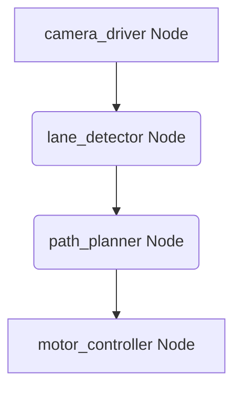
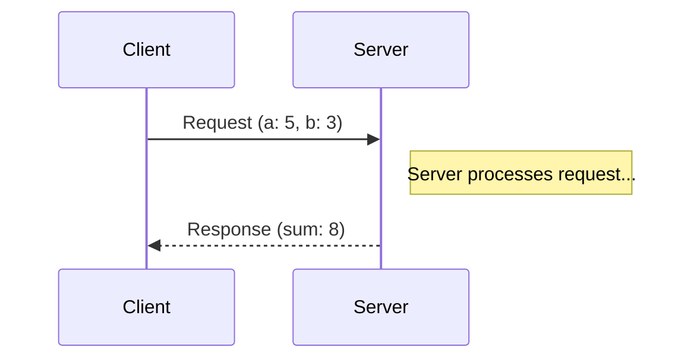

# Chapter 1: ROS 2 Fundamentals

Welcome to the foundational module of our journey into robotics and AI. Before we can build intelligent systems, we need to understand the "nervous system" that allows the different parts of a robot to communicate. In modern robotics, that nervous system is the **Robot Operating System (ROS)**. This chapter focuses on **ROS 2**, the latest generation of ROS, and its three most critical communication concepts: **Nodes**, **Topics**, and **Services**.

A robot is a complex system comprising sensors for perception, actuators for movement, and processing units for decision-making. ROS 2 acts as the central communication backbone, enabling these disparate components to interact seamlessly. It is designed to handle complexity, facilitate collaboration among developers, and promote code reusability, even when components are written in different programming languages or run on different machines.

## The ROS 2 Graph: A Network of Nodes

The entire communication framework in ROS 2 is visualized as the **ROS Graph**. This graph is a dynamic network representing all active ROS 2 processes (called **Nodes**) and the data flows (Topics and Services) connecting them. Understanding the ROS Graph is key to building, debugging, and comprehending ROS 2 systems.

### What is a ROS 2 Node?

A **Node** is the most fundamental unit of computation in a ROS 2 system. It's an executable program designed to perform a single, specific task. This modular design philosophy is central to ROS 2:

*   **Modularity**: Instead of monolithic applications, ROS 2 encourages breaking down complex robotic behaviors into many small, independent nodes. For example, a robot might have a dedicated node for reading a specific sensor, another for controlling a particular motor, and yet another for implementing a navigation algorithm.
*   **Reusability**: Individual nodes can be reused across different projects and robots.
*   **Maintainability**: Debugging and updating a small, focused node is far simpler than dealing with a large, intertwined codebase.
*   **Scalability**: ROS 2 can distribute nodes across multiple computers or process cores, allowing systems to scale from simple embedded devices to complex multi-robot fleets.

**Analogy: The Expert Team**
Imagine a robotic system as a highly specialized team. Each team member is a **Node**, and each has one job:
-   The **`camera_driver` Node**: Its sole purpose is to capture raw images from the robot's camera.
-   The **`lane_detector` Node**: Its job is to analyze images and identify lane lines.
-   The **`path_planner` Node**: Takes lane information and calculates the optimal path.
-   The **`motor_controller` Node**: Receives path commands and translates them into motor signals.

This division of labor makes the entire system robust and adaptable.



You can inspect the running ROS 2 graph and see all active nodes in real-time using the command line:

```bash
ros2 node list
```

This command will output a list of all node names currently running in the ROS 2 network.

## Topics: The Public Bulletin Board for Continuous Data

Nodes need a way to communicate. The primary mechanism for this in ROS 2 is through **Topics**. A Topic is a named channel over which nodes can exchange data. This communication model is a publish-subscribe (pub-sub) pattern, which is asynchronous and ideal for broadcasting continuous streams of data.

### Publisher and Subscriber Roles

1.  **Publisher**: A node that sends (publishes) messages to a specific Topic. A publisher doesn't know or care who is listening; it simply broadcasts its data.
2.  **Subscriber**: A node that is interested in the data on a specific Topic. It subscribes to that Topic and receives (subscribes to) messages published on it.
3.  **Message**: The actual data being exchanged. ROS 2 defines standard message types (like `String`, `Int32`, `Float64`, `Time`) and allows you to define custom message types for specific data structures. Messages are strongly typed, ensuring that publishers and subscribers agree on the data format.

**Analogy: The Restaurant Kitchen's Ticket System**
Imagine a busy restaurant kitchen:
-   The **Waiters** (Publishers) take orders from customers and write them on tickets. They then post these tickets on a central ticket dispenser (the Topic).
-   The **Chefs** (Subscribers) are responsible for cooking different parts of the meal. They look at the ticket dispenser (the Topic) and pick up any tickets (Messages) they are interested in preparing.
-   The **Tickets** themselves are the Messages, containing details like the dish, order number, and special instructions.

This system is efficient because waiters don't need to know which chef will cook what, and chefs can focus on their specific tasks without directly interacting with the waiter. A single order ticket can be seen by multiple chefs.

### Publisher/Subscriber Workflow in Practice

Consider our autonomous robot example again:
1.  The `camera_driver` node **publishes** raw image data (a `sensor_msgs/Image` message) to a topic named `/camera/image_raw`.
2.  The `lane_detector` node **subscribes** to `/camera/image_raw`. Whenever a new image message arrives, the `lane_detector` processes it to identify lane boundaries.
3.  The `lane_detector` then **publishes** its findings (perhaps a custom `Lane` message) to a topic like `/vision/lane_boundaries`.
4.  The `decision_maker` node **subscribes** to `/vision/lane_boundaries` to receive the lane data and make steering decisions.

This demonstrates a flexible data pipeline. New nodes can easily be added to subscribe to existing topics without altering the publishers.

```mermaid
graph LR
    subgraph "Camera Node"
        A[Publishes <br> "/camera/image_raw" <br> (Image)]
    end
    subgraph "Lane Detector Node"
        B(Subscribes <br> "/camera/image_raw")
        C(Publishes <br> "/vision/lane_boundaries" <br> (Lane))
    end
    subgraph "Decision Maker Node"
        D(Subscribes <br> "/vision/lane_boundaries")
    end

    A --> B;
    C --> D;
```

### `rclpy` Example: A Simple Publisher

Here's a basic Python node using `rclpy` that acts as a publisher. This node will send a simple string message on a topic named `chatter` every second.

```python
# simple_publisher.py
import rclpy
from rclpy.node import Node
from std_msgs.msg import String  # Import the standard String message type

class SimplePublisher(Node):
    def __init__(self):
        # Initialize the node with a unique name 'simple_publisher'
        super().__init__('simple_publisher')
        
        # Create a publisher.
        # Arguments: message type, topic name, queue size
        self.publisher_ = self.create_publisher(String, 'chatter', 10)
        
        # Create a timer to call the timer_callback function every 1.0 second.
        self.timer_ = self.create_timer(1.0, self.timer_callback)
        
        self.get_logger().info('SimplePublisher node has been started.')

    def timer_callback(self):
        # Create a String message
        msg = String()
        msg.data = 'Hello from ROS 2 Publisher!'
        
        # Publish the message
        self.publisher_.publish(msg)
        
        # Log the action
        self.get_logger().info(f'Publishing: "{msg.data}"')

def main(args=None):
    # Initialize ROS 2 communications
    rclpy.init(args=args)
    
    # Create an instance of our publisher node
    node = SimplePublisher()
    
    try:
        # Keep the node alive and processing callbacks (like timer_callback)
        rclpy.spin(node)
    except KeyboardInterrupt:
        # Handle interruption (e.g., Ctrl+C)
        node.get_logger().info('Publisher stopped by user.')
    finally:
        # Clean up resources
        node.destroy_node()
        rclpy.shutdown()

if __name__ == '__main__':
    main()
```

### `rclpy` Example: A Simple Subscriber

This subscriber node listens to the `chatter` topic and prints any message it receives.

```python
# simple_subscriber.py
import rclpy
from rclpy.node import Node
from std_msgs.msg import String  # Import the standard String message type

class SimpleSubscriber(Node):
    def __init__(self):
        # Initialize the node with a unique name 'simple_subscriber'
        super().__init__('simple_subscriber')
        
        # Create a subscriber.
        # Arguments: message type, topic name, callback function, queue size
        self.subscription_ = self.create_subscription(
            String,
            'chatter',
            self.listener_callback,
            10)
            
        self.get_logger().info('SimpleSubscriber node has been started. Listening to "chatter" topic.')

    def listener_callback(self, msg):
        # This function is called every time a message is received on the 'chatter' topic
        self.get_logger().info(f'I heard: "{msg.data}"')

def main(args=None):
    # Initialize ROS 2 communications
    rclpy.init(args=args)
    
    # Create an instance of our subscriber node
    node = SimpleSubscriber()
    
    try:
        # Keep the node alive and processing callbacks (like listener_callback)
        rclpy.spin(node)
    except KeyboardInterrupt:
        # Handle interruption (e.g., Ctrl+C)
        node.get_logger().info('Subscriber stopped by user.')
    finally:
        # Clean up resources
        node.destroy_node()
        rclpy.shutdown()

if __name__ == '__main__':
    main()
```

To run these examples:
1.  Save each script (e.g., `simple_publisher.py`, `simple_subscriber.py`).
2.  Ensure you have a ROS 2 environment sourced.
3.  Run them in separate terminals:
    *   `python simple_publisher.py`
    *   `python simple_subscriber.py`
    You will see the publisher logging its messages, and the subscriber logging that it heard them.

### Interacting with Topics via Command Line

ROS 2 provides powerful command-line tools to inspect and interact with topics:
-   `ros2 topic list`: Lists all active topics.
-   `ros2 topic echo <topic_name>`: Displays messages published on a specific topic.
-   `ros2 topic pub <topic_name> <message_type> '<message_data>'`: Publishes a single message to a topic. For example:
    ```bash
    ros2 topic pub --once /robot/target std_msgs/msg/Int32 "{data: 50}"
    ```
-   `ros2 topic hz <topic_name>`: Shows the publishing rate of a topic.

## Services: The Direct Question and Answer

Topics are excellent for broadcasting data, but sometimes a node needs to request a specific computation or action from another node and wait for a definitive answer. This is the domain of **Services**.

A **Service** is a communication pattern based on a **request/response** model. It is synchronous: a **Service Client** sends a request to a **Service Server**, and the client blocks (waits) until the server processes the request and sends back a response.

**Analogy: The Customer Service Desk**
Consider a customer service desk:
-   The **Service Server** is the customer service representative. They are ready to handle specific types of queries (e.g., "What is my account balance?", "Reset my password").
-   The **Service Client** is the customer. They approach the desk (call the service) with a specific question or request (the **Request**).
-   The representative processes the request and provides a direct answer (the **Response**). The customer waits until they receive this answer before proceeding.

Services are ideal for tasks that are not continuous data streams but rather discrete operations, such as triggering a specific action, querying a configuration value, or confirming a state.

### Service Example: Adding Two Integers

A common ROS 2 example is a service that adds two numbers.
1.  A `math_server` node provides the `add_two_ints` service. It listens for requests containing two integers (`a` and `b`).
2.  A `math_client` node calls this service, sending two numbers.
3.  The `math_server` calculates their sum and sends it back as a response. The `math_client` receives the sum.



### `rclpy` Example: A Service Server

This node provides the `add_two_ints` service. It requires the `example_interfaces` ROS 2 package, which provides standard ROS 2 interfaces for services and messages.

```python
# simple_service_server.py
import rclpy
from rclpy.node import Node
# Import the service type from example_interfaces
from example_interfaces.srv import AddTwoInts 

class SimpleServiceServer(Node):
    def __init__(self):
        # Initialize the node with a unique name
        super().__init__('simple_service_server')
        
        # Create a service.
        # Arguments: service type, service name, callback function
        self.service_ = self.create_service(
            AddTwoInts, 
            'add_two_ints', 
            self.add_two_ints_callback)
            
        self.get_logger().info('SimpleServiceServer ready to add two ints.')

    def add_two_ints_callback(self, request, response):
        # This callback is executed when a client calls the service.
        # 'request' contains the input data (e.g., request.a, request.b)
        # 'response' is an object to fill with the result (e.g., response.sum)
        
        response.sum = request.a + request.b
        self.get_logger().info(f'Incoming request: a={request.a}, b={request.b}. Sending response: {response.sum}')
        
        # Return the response object
        return response

def main(args=None):
    rclpy.init(args=args)
    node = SimpleServiceServer()
    try:
        # Keep the node alive to respond to service calls
        rclpy.spin(node)
    except KeyboardInterrupt:
        node.get_logger().info('Service server stopped.')
    finally:
        node.destroy_node()
        rclpy.shutdown()

if __name__ == '__main__':
    main()
```

### `rclpy` Example: A Service Client

This client calls the `add_two_ints` service. It sends two numbers and waits for the sum.

```python
# simple_service_client.py
import rclpy
from rclpy.node import Node
from example_interfaces.srv import AddTwoInts # Import the service type
import sys # To read command-line arguments

class SimpleServiceClient(Node):
    def __init__(self):
        # Initialize the node with a unique name
        super().__init__('simple_service_client')
        
        # Create a client for the 'add_two_ints' service.
        # Arguments: service type, service name
        self.client_ = self.create_client(AddTwoInts, 'add_two_ints')
        
        # Wait for the service server to be available.
        # This is important to ensure the service is actually running.
        while not self.client_.wait_for_service(timeout_sec=1.0):
            self.get_logger().info('Service "add_two_ints" not available, waiting...')
            
        # Create a request object for the service
        self.request_ = AddTwoInts.Request()

    def send_request(self, a, b):
        # Populate the request with data
        self.request_.a = a
        self.request_.b = b
        
        # Call the service asynchronously
        self.future_ = self.client_.call_async(self.request_)
        
        # Wait for the service call to complete
        rclpy.spin_until_future_complete(self, self.future_)
        
        # Return the result
        return self.future_.result()

def main(args=None):
    rclpy.init(args=args)
    
    # Check if two integer arguments were provided from the command line
    if len(sys.argv) != 3:
        print("Usage: python simple_service_client.py <integer1> <integer2>")
        return

    node = SimpleServiceClient()
    
    # Send the request with numbers from command line arguments
    response = node.send_request(int(sys.argv[1]), int(sys.argv[2]))
    
    if response:
        node.get_logger().info(f'Result of add_two_ints: {sys.argv[1]} + {sys.argv[2]} = {response.sum}')
    else:
        node.get_logger().error('Service call failed.')
        
    node.destroy_node()
    rclpy.shutdown()

if __name__ == '__main__':
    main()
```

To run the service example:
1.  Save the server code as `simple_service_server.py` and client code as `simple_service_client.py`.
2.  Ensure you have a ROS 2 environment sourced.
3.  In one terminal, run the server: `python simple_service_server.py`
4.  In another terminal, run the client with two numbers: `python simple_service_client.py 10 5`
    You should see the two nodes communicating, with the client logging the sum.

### Interacting with Services via Command Line

Similar to topics, ROS 2 offers command-line tools for services:
-   `ros2 service list`: Lists all available services.
-   `ros2 service type <service_name>`: Shows the service type (e.g., `example_interfaces/srv/AddTwoInts`).
-   `ros2 service call <service_name> <service_type> '<request_data>'`: Calls a service. For example:
    ```bash
    ros2 service call /add_two_ints example_interfaces/srv/AddTwoInts "{a: 15, b: 7}"
    ```

## Summary: Topics vs. Services

| Feature       | Topics                                          | Services                                          |
|---------------|-------------------------------------------------|---------------------------------------------------|
| **Pattern**   | Publisher / Subscriber                          | Client / Server                                   |
| **Direction** | One-way (Publish -> Subscribe)                  | Two-way (Request -> Response)                     |
| **Sync**      | Asynchronous (fire and forget)                  | Synchronous (client waits for response)           |
| **Use Case**  | Continuous data streams (sensor data, state) | Remote Procedure Calls (RPC), discrete actions    |
| **Data Flow** | Many-to-many, broadcasted                       | One-to-one, direct interaction                    |

By understanding Nodes, Topics, and Services, you now have the fundamental building blocks to create powerful and modular robotics applications with ROS 2. In the next chapter, we will dive deeper into how Python-based AI agents can leverage this nervous system to bring intelligence to our robot.
