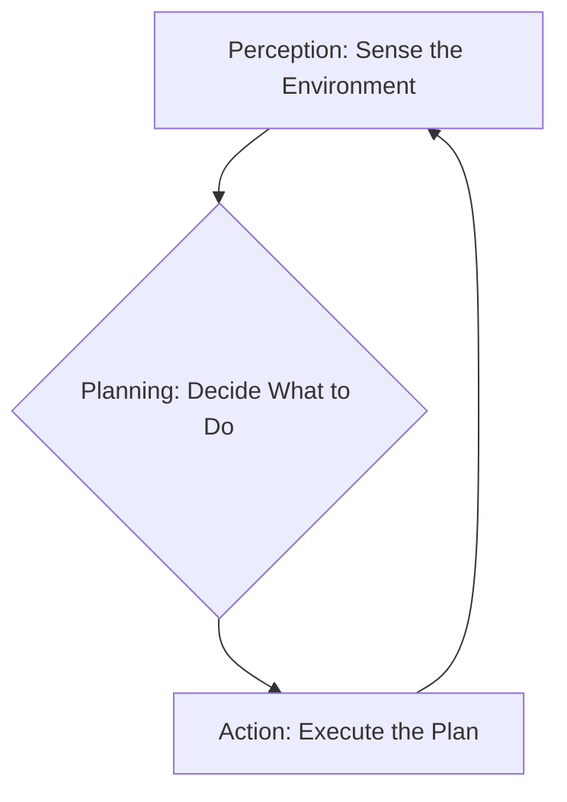
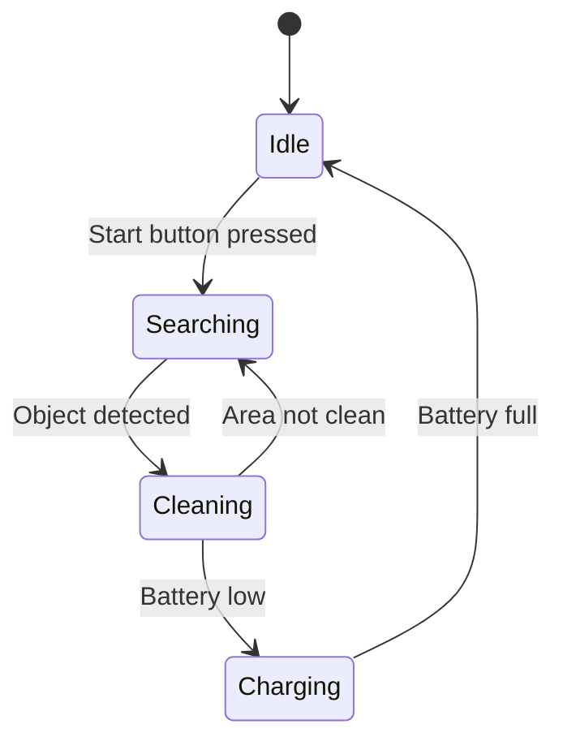
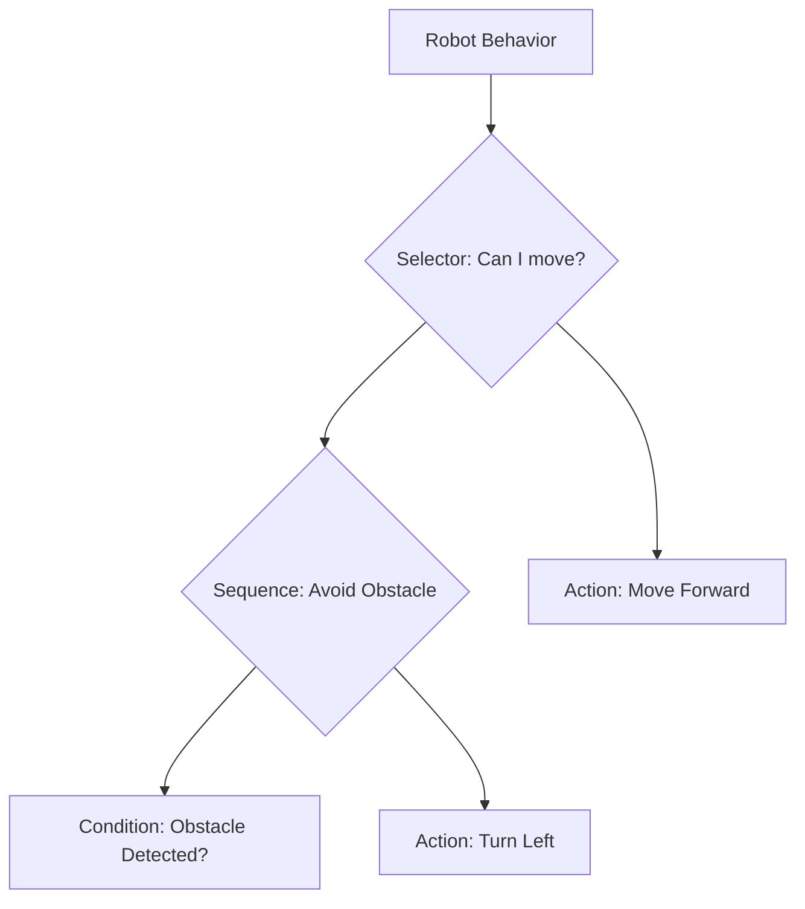

## Navigating the Robot's Mind: An Introduction to AI Decision Pipelines

Have you ever wondered how a robot decides what to do next? From a self-driving car smoothly changing lanes to a robotic arm precisely assembling a product, every intelligent action stems from a sophisticated "brain" that processes information and makes choices. This brain isn't a single, monolithic entity, but rather a series of interconnected processes known as **AI Decision Pipelines**.

This chapter will demystify these pipelines, offering you a foundational understanding of how robots perceive their environment, plan their movements, and execute actions. We'll break down the core components: **perception**, where raw sensor data transforms into meaningful insights; **planning**, where the robot strategizes its next steps; and **action**, where those plans are translated into physical commands. We'll also explore common decision-making patterns like **state machines** and **behavior trees**, which provide structured ways to manage complex robot behaviors. Finally, we'll see how these concepts integrate seamlessly within the **ROS 2** framework, the leading operating system for robotics development. By the end of this chapter, you'll have a clear roadmap for building intelligent, autonomous robotic systems.

## The Core Components of a Decision Pipeline

At its heart, a robot's decision-making process can be broken down into three fundamental components: Perception, Planning, and Action. These components form a continuous loop, allowing the robot to sense the world, think about what to do, and then act on its decisions.



### 1. Perception: The Robot's Senses

Perception is how a robot understands its surroundings. Just as we use our eyes, ears, and sense of touch, a robot relies on a suite of sensors to gather data about the world. This raw data, however, is just a stream of numbers. The perception component's job is to turn this data into meaningful information.

- **What it does:** Collects and processes data from sensors like cameras, LiDAR, and IMUs. This involves tasks like identifying objects, detecting obstacles, or determining the robot's own position (localization).
- **Why it's important:** Without perception, a robot is essentially blind and deaf, unable to make informed decisions about how to interact with its environment.

### 2. Planning: The Robot's Brain

Once the robot has a clear picture of its environment, it needs to decide what to do next to achieve its goals. This is the role of the planning component. It acts as the robot's "brain," formulating a strategy to move from its current state to a desired state.

- **What it does:** Takes the processed information from the perception stage and generates a sequence of steps or a path to achieve a goal. This could involve calculating the shortest path to a destination, determining the best way to grasp an object, or deciding which task to perform first.
- **Why it's important:** Planning enables the robot to act with intention and intelligence, rather than just reacting to its surroundings.

### 3. Action: The Robot's Body

After a plan is in place, the robot needs to execute it in the physical world. The action component is responsible for translating the planner's high-level commands into low-level control signals for the robot's motors and actuators.

- **What it does:** Converts the plan into physical movements. This could mean sending velocity commands to the wheels, controlling the joints of a robotic arm, or activating a gripper.
- **Why it's important:** Action is how the robot brings its decisions to life, interacting with and changing its environment. This completes the loop, as the robot's actions will create a new state of the world that it must then perceive.

## Common Decision-Making Patterns

While the Perception-Planning-Action loop provides a high-level framework, we need specific patterns to structure the decision-making logic. Two of the most common patterns in robotics are State Machines and Behavior Trees.

### State Machines

A **Finite State Machine (FSM)** is a model where a robot's behavior is divided into a finite number of states. The robot can only be in one state at a time, and it transitions between states based on specific events or conditions.

Think of it like a traffic light: it can be in a "Red," "Yellow," or "Green" state, and it transitions based on a timer.



- **Pros:** Simple to understand and implement for well-defined, sequential tasks.
- **Cons:** Can become very complex and difficult to manage as the number of states and transitions grows.

### Behavior Trees

A **Behavior Tree (BT)** is a more modern and flexible approach that organizes tasks in a hierarchical, tree-like structure. It's like a detailed to-do list that the robot continuously checks. Nodes in the tree can be actions (like "move forward"), conditions (like "is an obstacle ahead?"), or control flow nodes that decide which task to execute next.



In this example, the robot first checks if it can move. It tries the "Avoid Obstacle" sequence first. If an obstacle is detected, it turns left. If no obstacle is detected, that sequence "fails," and the selector moves on to the next option: "Move Forward."

- **Pros:** Highly modular, scalable, and great for complex behaviors in dynamic environments.
- **Cons:** Can be slightly more complex to set up initially than a simple state machine.

## ROS 2 Integration: A Simple Decision Node

Now, let's see how these concepts translate into code. We'll create a simple ROS 2 node in Python that makes a decision based on sensor input. This node will subscribe to a topic that gives information about the environment and publish commands to control the robot.

Here is the code for our `decision_node.py`:

```python
# Import necessary ROS 2 libraries
import rclpy
from rclpy.node import Node
from std_msgs.msg import String

class DecisionNode(Node):
    """
    A simple ROS 2 decision node that subscribes to a sensor topic
    and publishes commands to a control topic based on the sensor input.
    """
    def __init__(self):
        super().__init__('decision_node')
        self.get_logger().info('Decision Node has been started.')

        # Create a publisher for the control topic
        self.command_publisher = self.create_publisher(String, 'robot_command', 10)
        
        # Create a subscriber for the sensor topic
        self.sensor_subscriber = self.create_subscription(
            String,
            'sensor_input',
            self.sensor_callback,
            10
        )

    def sensor_callback(self, msg):
        """
        Callback function for the sensor_input subscriber.
        """
        self.get_logger().info(f'Received sensor data: "{msg.data}"')
        command_msg = String()

        # Core decision logic
        if msg.data == 'obstacle':
            command_msg.data = 'stop'
            self.get_logger().info('Decision: Obstacle detected, sending "stop" command.')
        elif msg.data == 'clear':
            command_msg.data = 'move'
            self.get_logger().info('Decision: Path clear, sending "move" command.')
        else:
            command_msg.data = 'unknown'
            self.get_logger().warn(f'Received unknown sensor data: "{msg.data}", sending "unknown" command.')

        # Publish the command
        self.command_publisher.publish(command_msg)

def main(args=None):
    rclpy.init(args=args)
    decision_node = DecisionNode()
    rclpy.spin(decision_node)
    decision_node.destroy_node()
    rclpy.shutdown()

if __name__ == '__main__':
    main()
```

### Code Explanation

1.  **`import` statements**: We import `rclpy` for ROS 2 functionality, `Node` to create our node class, and `String` as our message type.
2.  **`DecisionNode` class**: This class inherits from `Node` and represents our decision-making node.
3.  **`__init__` constructor**:
    *   `super().__init__('decision_node')`: Initializes the node with the name `decision_node`.
    *   `self.create_publisher(...)`: Creates a publisher that sends `String` messages to the `robot_command` topic.
    *   `self.create_subscription(...)`: Creates a subscriber that listens for `String` messages on the `sensor_input` topic. When a message arrives, it calls the `sensor_callback` function.
4.  **`sensor_callback` function**:
    *   This function is the heart of our decision-making logic. It's triggered every time a message is received on the `sensor_input` topic.
    *   It checks the content of the message (`msg.data`). If it's `'obstacle'`, it decides to `'stop'`. If it's `'clear'`, it decides to `'move'`.
    *   Finally, it publishes the decision as a `String` message on the `robot_command` topic.
5.  **`main` function**: This is the standard entry point for a Python ROS 2 node. It initializes `rclpy`, creates an instance of our `DecisionNode`, and then calls `rclpy.spin()` to keep the node alive and processing messages.

## Expanding the Decision Logic

Our simple decision node is a great start, but real-world robots need to consider multiple factors. Let's expand our node to also consider the robot's battery level.

In this new example, the robot will have a primary goal: if the battery is low, it must charge. Otherwise, it will revert to its obstacle avoidance behavior.

```python
import rclpy
from rclpy.node import Node
from std_msgs.msg import String, Float32

class SmartDecisionNode(Node):
    def __init__(self):
        super().__init__('smart_decision_node')
        self.battery_level = 1.0  # Assume full battery at start
        self.obstacle_status = 'clear'

        # Subscribers for sensor and battery
        self.create_subscription(String, 'sensor_input', self.obstacle_callback, 10)
        self.create_subscription(Float32, 'battery_level', self.battery_callback, 10)

        # Publisher for commands
        self.command_publisher = self.create_publisher(String, 'robot_command', 10)

        # A timer to make decisions at a regular interval
        self.timer = self.create_timer(0.5, self.make_decision)
        self.get_logger().info('Smart Decision Node has been started.')

    def obstacle_callback(self, msg):
        self.obstacle_status = msg.data

    def battery_callback(self, msg):
        self.battery_level = msg.data

    def make_decision(self):
        command_msg = String()
        # Priority 1: Check battery level
        if self.battery_level < 0.2:
            command_msg.data = 'charge'
        # Priority 2: Check for obstacles
        elif self.obstacle_status == 'obstacle':
            command_msg.data = 'stop'
        # Default action
        else:
            command_msg.data = 'move'
        
        self.get_logger().info(f'Battery: {self.battery_level:.2f}, Obstacle: {self.obstacle_status} => Command: {command_msg.data}')
        self.command_publisher.publish(command_msg)

def main(args=None):
    rclpy.init(args=args)
    smart_decision_node = SmartDecisionNode()
    rclpy.spin(smart_decision_node)
    smart_decision_node.destroy_node()
    rclpy.shutdown()

if __name__ == '__main__':
    main()
```

This enhanced node demonstrates how a robot can handle multiple inputs and prioritize its actions, which is a fundamental concept in building more complex and robust AI systems.

## Conclusion

This chapter has laid the groundwork for understanding how AI-powered robots make decisions. We've seen that the process is a continuous loop of **perception**, **planning**, and **action**. We've also explored common patterns like **State Machines** and **Behavior Trees** that give structure to this process, and we've built a simple decision-making node in ROS 2.

However, a robot's decisions are only as good as its perception of the world. In the next chapter, we'll dive deeper into the crucial first step of our pipeline: **Sensor Fusion & Perception**. We'll explore how robots can combine data from multiple sensors to build a rich and reliable understanding of their environment, paving the way for more intelligent and robust decision-making.
