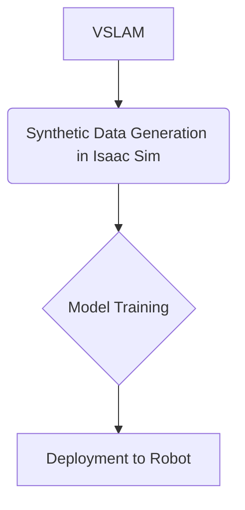

# Chapter 2: Synthetic Data Generation Use Cases

## Introduction to Synthetic Data Generation for Humanoid Robotics

The development of advanced AI models for humanoid robots is heavily reliant on vast and diverse datasets. However, collecting and labeling real-world data for complex robotic scenarios can be prohibitively expensive, time-consuming, and often dangerous. This is where synthetic data generation, particularly within high-fidelity simulation environments like NVIDIA Isaac Sim, becomes indispensable. Synthetic data offers a scalable, controllable, and perfectly labeled alternative, accelerating the training and validation of AI perception, control, and interaction systems for humanoids. This chapter delves into the advanced techniques and compelling use cases of synthetic data generation, emphasizing its transformative impact on humanoid robotics.

### Synthetic Data Generation and Its Usage

Synthetic data generation in Isaac Sim is a cornerstone for advanced AI training in robotics. It addresses the critical challenge of acquiring diverse, labeled datasets—a bottleneck for developing robust deep learning models. Isaac Sim allows developers to programmatically create and control virtual environments, populating them with assets, lighting conditions, and dynamic scenarios that would be impractical or impossible to replicate in the real world.

Key aspects of synthetic data generation in Isaac Sim include:

*   **Automated Labeling**: Unlike real-world data collection where labeling is a manual, laborious, and error-prone process, Isaac Sim automatically generates perfect ground truth labels for every pixel and object in the scene. This includes:
    *   **Semantic Segmentation**: Pixel-level classification of objects (e.g., distinguishing "robot arm" from "table" from "floor").
    *   **Instance Segmentation**: Identifying individual instances of objects.
    *   **Bounding Boxes**: Accurate 2D and 3D boxes around objects.
    *   **Depth Maps**: Precise distance information to surfaces.
    *   **Object Poses**: 6-DoF pose (position and orientation) of all objects.
*   **Domain Randomization**: A powerful technique where various parameters of the simulation (e.g., textures, lighting, object positions, camera angles, physics properties) are randomized during data generation. This helps to improve the generalization capabilities of models trained on synthetic data, making them more robust to variations encountered in real-world deployments.
*   **Scale and Diversity**: Isaac Sim can generate vast quantities of data quickly, covering a wide range of scenarios, including rare edge cases or hazardous conditions that are difficult or unsafe to collect physically. This diversity is crucial for training models that are resilient to unexpected situations.
*   **Data Augmentation**: Beyond randomization, Isaac Sim can simulate different sensor types and their imperfections (e.g., noise, blur, occlusions) to make the synthetic data even more representative of real-world sensor streams.

**Usage for Model Training**:

The high-quality, perfectly labeled synthetic data from Isaac Sim is directly fed into deep learning pipelines to train various AI models:

*   **Perception Models**: Training object detectors, instance segmenters, and pose estimators for tasks like grasping, navigation, and human-robot interaction.
*   **Reinforcement Learning (RL) Agents**: Providing realistic sensory input for RL agents to learn complex behaviors and control policies in simulated environments before transferring them to physical robots (sim-to-real transfer).
*   **Anomaly Detection**: Generating data for normal and anomalous conditions to train models that can identify unusual events or failures.

By leveraging synthetic data, developers can significantly reduce the time and cost associated with data acquisition, accelerate the iterative development cycle of AI models, and ultimately deploy more capable and robust robotic systems.

### Synthetic Data Generation Use Cases in Humanoid Robotics

1.  **Training for Robust Navigation in Unstructured Environments**:
    *   **Challenge**: Humanoid robots often need to navigate complex, unstructured environments (e.g., disaster zones, construction sites) where real-world data collection is dangerous or impossible.
    *   **Isaac Sim Solution**: Isaac Sim can simulate these hazardous environments, generating synthetic LiDAR, depth camera, and RGB data. By randomizing debris, obstacles, lighting, and terrain, vast datasets can be created to train robust navigation policies. Ground truth information (e.g., traversable areas, obstacle locations) is automatically provided.
    *   **Benefit**: Enables the training of navigation algorithms that are resilient to unforeseen obstacles and variable conditions, without putting physical robots at risk.

2.  **Grasping and Manipulation of Novel Objects**:
    *   **Challenge**: Humanoid robots, with their anthropomorphic hands, are designed for versatile manipulation. However, training them to grasp novel or irregularly shaped objects requires extensive data on object properties, stable grasp poses, and force feedback.
    *   **Isaac Sim Solution**: Isaac Sim allows for the rapid generation of diverse 3D object models with varied textures, materials, and physics properties. Synthetic data can be generated for different camera angles and gripper configurations, providing perfect annotations for object pose estimation, grasp success prediction, and force sensor readings. Domain randomization further enhances the transferability of these models to real-world objects.
    *   **Benefit**: Accelerates the development of advanced grasping capabilities, enabling humanoids to interact effectively with a wider range of objects in dynamic environments.

### Workflow Overview: From VSLAM to Deployment

This diagram illustrates the integrated workflow, starting from initial VSLAM data that can inform synthetic data generation strategies, through the crucial phase of model training, and finally to the deployment of these AI models onto physical robots for real-world application.

## Conclusion

Synthetic data generation, empowered by platforms like NVIDIA Isaac Sim, represents a paradigm shift in robotics AI development. It not only addresses the practical limitations of real-world data but also unlocks new possibilities for training highly capable and resilient humanoid robots. As simulation fidelity continues to advance, the role of synthetic data will only grow, paving the way for humanoids that can safely and effectively operate in increasingly complex and dynamic environments.
